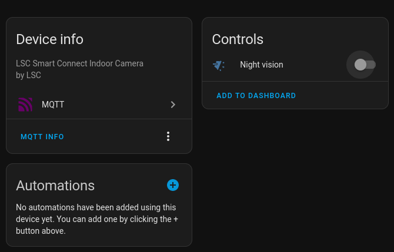

# LSCProxy

## Overview

The **LSCProxy** is a Python script designed to establish a connection to an IPCAM (Internet Protocol Camera) using the Tutk library. It configures various AVIOCTRL (Audio and Video Input/Output Control) commands to initiate streaming and manages multiple threads for video and audio reception, RTSP (Real-Time Streaming Protocol) server, ffmpeg streaming, and periodic buffer cleanup. Additionally, it supports MQTT with Home Assistant integration.

## Prerequisites

Before using the script, ensure you have the following:

- Python 3.x installed
- ffmpeg
- mediamtx (Included)

## Usage

Run the script with the following command:

```bash
python main.py <UID>
```

Where `<UID>` is the unique identifier of the IPCAM.

**Note**: This script should be executed with the UID as a command-line argument.

## Main File

### [main.py](main.py)

This script is the main entry point, responsible for connecting to the IPCAM, configuring streaming, managing threads, and handling various IOCTRL commands.


## Running the Script

1. Copy `settings.yaml.example` to `settings.yaml` and change the variables to your situation.

2. Execute the script with the UID of the target IPCAM as a command-line argument.

```bash
python main.py <UID>
```

3. If you want to control sensors using Home Assistant. Change the MQTT variables to your needs in `settings.yaml`.

## Screenshots

### Homeasistant



## Todo

* Support for multiple camera's

## License

This software is released under the [BOLA License](LICENSE).

## Sources

* https://github.com/ErikMcClure/bad-licenses/blob/master/BOLA-License