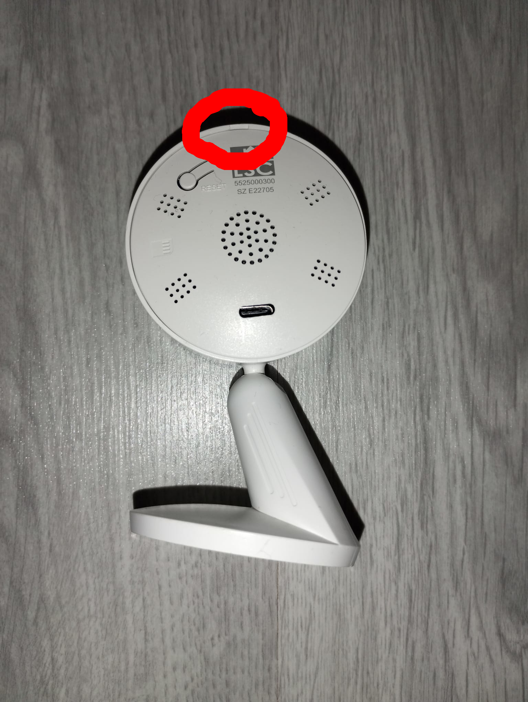
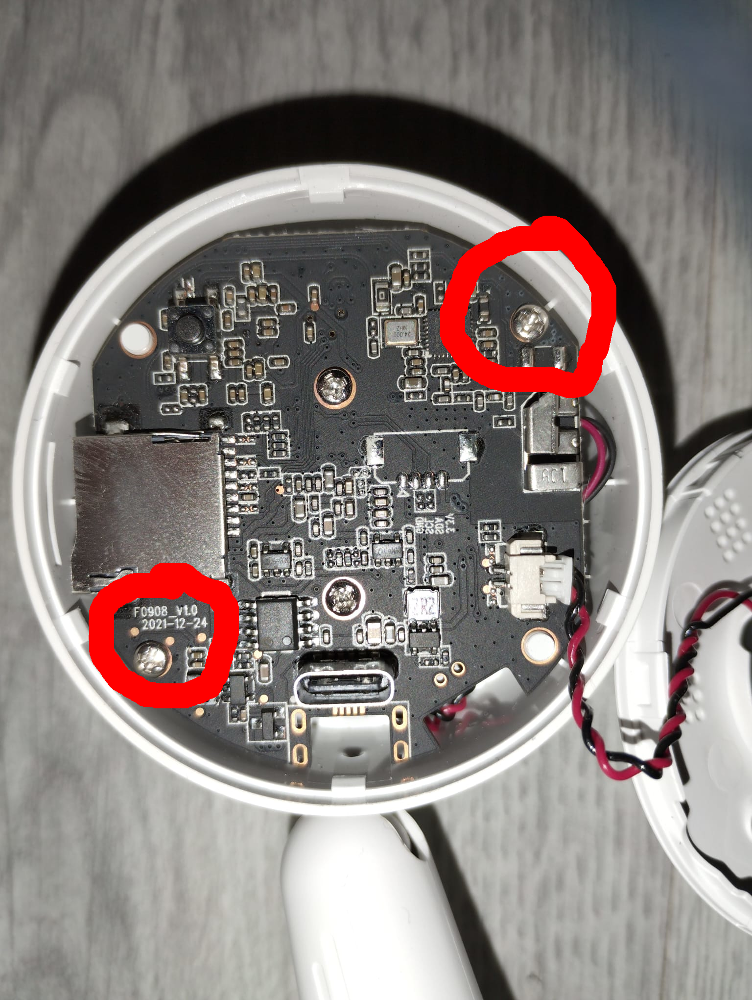
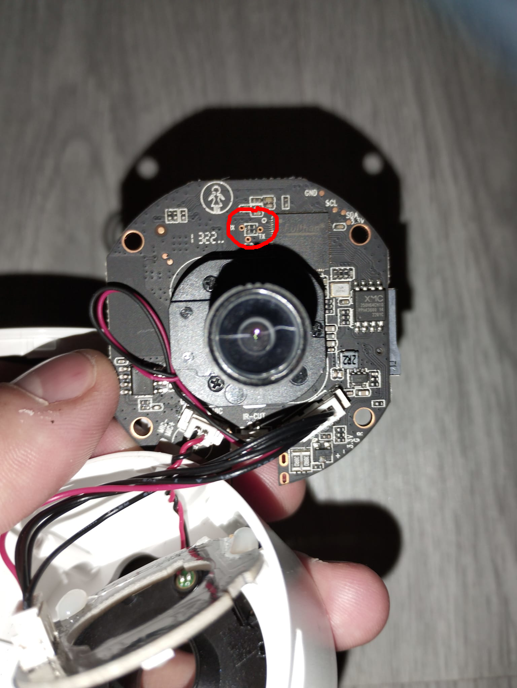
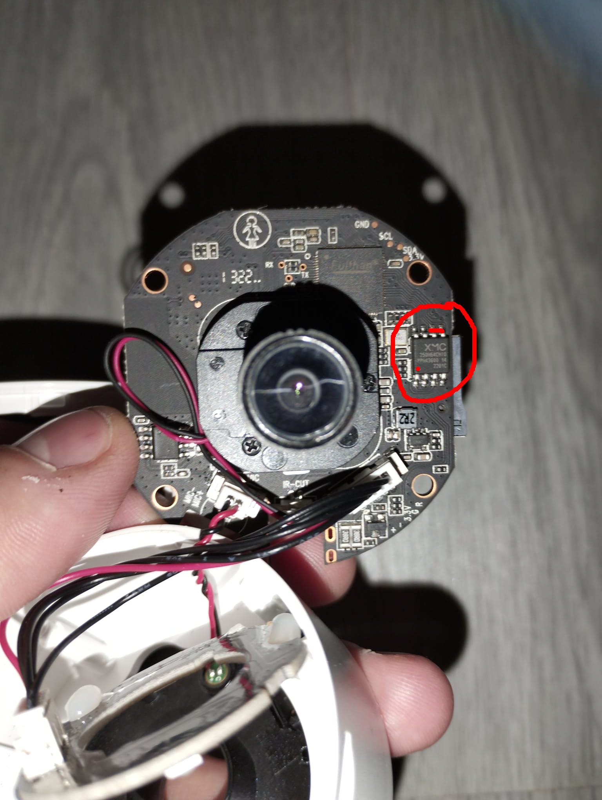

# LSC Indoor Camera 1080P Local Patch

## Project description

This repository contains methods to make the LSC Indoor Camera 1080p work locally. By adjusting the settings correctly, you can make the camera run a small p2p TUTK server instead of the tuya stack which requires you to use their cloud solution.

## Credits

Some files and pieces of code are sourced from: https://github.com/guino/LSC1080P. This guy made it possible to develop faster on the device.

* `reredirect`
* `busybox`
* `cgi-bin`
* `httpd.conf`
* `index.html`
* `upload.html`
* `custom.sh`

## The hack in a nutshell

When placing a `product.cof` file on the SD Card with `stationssid` and `stationpwd` defined, the application will go into a development mode. This development code consists of a p2p streaming server based on TUTK. This stream can be used by their p2p client library. One such application that implements this client library is: TinyCam: https://tinycammonitor.com and will be used in the setup described in this repository. If you want a standalone solution with RTSP, you can also make use of a video proxy I have developed: [LSCProxy](https://github.com/berobloom/LSCIndoorCameraLocal1080p/tree/main/LSCProxy "LSC Indoor Proxy"). To maintain a consistent boot into this development mode, you must open the device and reflash it.

## Features.

### What works?

* Video streaming
* Audio streaming
* Recordings
* Motion detection (With TinyCam)
* Screen flip
* Manual nightvision
* Auto nightvision
* Telnet

### What does not (yet) work?

* 2-Way audio

## Default camera settings

The camera has the following hardcoded settings, but the root password can be changed during the device reflash process. I'm currently researching the possibility of patching the application to enable users to set custom credentials dynamically.

* Root user: `root`
* Root password: `dgiot010`
* p2p UID: `DGIOTDEV<mac_adres>`
  * For example: `DGIOTDEVA1B1C1D1E1A1`
* p2p user: `defusr`
* p2p password: `defpwd`

## Prerequisites

For this project you need the following:

### Hardware

* An LSC Indoor Camera 1080P (Production date: 2021)
* An Android Device with TinyCam https://play.google.com/store/apps/details?id=com.alexvas.dvr&pcampaignid=web_share. (Android X86 also works!)
* A small philips screwdriver
* An USB To TTL
* An MicroSD card reader
* Soldering skills or a BDM Frame < (Recommended)
* Dupont cables
* Common sense

### Software

The instructions are written for a Linux host: Ubuntu 22.04 LTS, but you can choose your own OS and packages if you know what you're doing.

#### OS

Ubuntu 22.04 LTS host (Physical/virtual)

#### Packages

* `binwalk`
* `screen`
* `xz-utils`

## Modifying the Camera

⚠️ WARNING ⚠️

You are about to modify the software on this camera. This will void your warranty. I am not responsible for any damage that occurs during modification. Stop immediately if there are differences between hardware/software on the camera and this manual. The worst that can happen is that your smart camera will turn into a dummy camera. Contact me if you need help or have questions.

### 0. Set a working dir

```
export WORKING_DIR=/location/to/a/folder
cd "${WORKING_DIR}"
```

### 1. Open the case

Open the case as seen on the following image:



Remove the following screws:



### 2. Insert an empty MicroSD card

Insert a MicroSD card up to 128GB in the camera.

### 3. Serial connection

There are three connection points as seen on the following image:



Connect the camera to the serial:

* Camera `TX` -> Serial `RX`
* Camera `RX` -> Serial `TX`
* Camera `GRN` -> Serial `GRN`

If everything is connected, insert your USB TTY into your host.

Test the serial by opening a terminal and enter the following commands to set up a serial connection to the camera:

```
cd "${WORKING_DIR}"
sudo screen /dev/ttyUSB0 115200,ixoff
```

No error should appear and you should see a black screen. When turning on the camera, you should see the boot log.

Turn off the camera.

### 4. UBoot

This is the trickiest part. We need to have access to UBoot to backup and flash the device.
UBoot is set to zero delay so there is no way pressing a key to gain access to the UBoot.

Instead short the two following pins on the flash when booting:

Do this quickly after turning on the device!



This will take a few retries to get it right. You are done when you get a Uboot prompt.

Create environment variables in UBoot:

```
setenv baseaddr 0xA1000000
setenv flashsize 0x800000
saveenv
```

### 5. Create a full backup

First things first. Create a full backup. We need the full dump of the flash anyway.

Make sure you can see the UBoot prompt.

Copy contents of the flash (8MB) to the MicroSD card:

```
# COPY LINE FOR LINE!

mw.b ${baseaddr} ff ${flashsize}
sf probe 0
sf read ${baseaddr} 0x0 ${flashsize}
mmc write dev0 ${baseaddr} 0x10 0x4000
```

Disconnect the camera from power and insert the MicroSD card into your host.

Run the following to backup the flash to your host. Replace \<MicroSD card> with your setup. for example: `/dev/mmcblk0`, `/dev/sdc`.

```
sudo dd bs=512 skip=16 count=16384 if=<MicroSD card> of=./fulldump.bin
sudo chown ${USER}: fulldump.bin
```

### 6. Extract the binary

Extract the binary using:

```
binwalk -e fulldump.bin
```

This will result in a `_fulldump.bin.extracted` folder.

Save the following line that binwalk outputs:

```
2490368       0x260000        Squashfs filesystem, little endian, version 4.0, compression:xz, size: 4671622 bytes, 222 inodes, blocksize: 131072 bytes, created: 2022-04-27 11:38:29
```

In my setup the squashfs starts at block `2490368`. We need this number when recreating squashfs.

⚠️ Don't use this number if this is not equal to yours!! ⚠️. When in doubt, you can contact me.

### 7. Patch dgiot application

1. There is a motion detector running in the background. It will output if there is some motion going on. Normally the tuya stack takes care of this motion. We can patch this out.

2. TUTK credentials are hardcoded inside the application binary. A patch has been added so that credentials can be changed.

Check the sha256sum of: `_fulldump.bin.extracted/squashfs-root/usr/bin/dgiot`:

```
sha256sum _fulldump.bin.extracted/squashfs-root/usr/bin/dgiot
```

It should output the following hash. Only when the hash has matched with your `dgiot` binary you can continue.

```
6414cf6fd457634e3b0ed62a584a2077632b85c59d14f1d843c85b389a80d96a  dgiot
```

Patch `_fulldump.bin.extracted/squashfs-root/usr/bin/dgiot` with `files/dgiot_patch.ips` using either

* https://www.marcrobledo.com/RomPatcher.js/

or

* https://www.romhacking.net/utilities/240/

### 8. Copy and edit files

Copy the files from this repo to the following locations:

* `files/env` to: `MicroSD card`
  * Set `TZ` and `TIMESERVER`
* `product.cof`  to: `MicroSD card`
  * Set `stationssid` and `stationpwd`
* `files/busybox` to: `MicroSD card`
* `files/data` to: `MicroSD card`
* `files/hosts` to: `_fulldump.bin.extracted/squashfs-root/etc/`
* `files/init.sh` to `_fulldump.bin.extracted/squashfs-root/usr/bin/`

If you want to get rid of the default startup sound (Optional):

* `files/iat.g711u` to: `_fulldump.bin.extracted/squashfs-root/usr/audio/cn/`

You can also create one yourself in `g711u` format.

Replace the following lines in:

`_fulldump.bin.extracted/squashfs-root/usr/init/app_init.sh`

From:

```
if [ "$1" == "0" ];then
        echo "stop"
else
        echo "start"
        cd /usr/bin
        ./daemon&
        ./dgiot&
fi
```

To:

```
if [ "$1" == "0" ];then
        echo "stop"
else
        echo "start"
        cd /usr/bin
        ./init.sh
fi
```

### 9. Recreate squashfs

Recreate the squashfs as follows:

```
cd _fulldump.bin.extracted/
mksquashfs squashfs-root/ rootmod -comp xz
```

### 10. Merge squashfs with the full backup

Prepare file dump for modification:

```
cd "${WORKING_DIR}"
cp fulldump.bin fullmod.bin
cp _fulldump.bin.extracted/rootmod .
```

Merge `rootmod` into `fullmod.bin`. Use the block number we have saved earlier. In my case: `2490368`.

```
dd if=rootmod of=fullmod.bin conv=notrunc bs=1 seek=2490368
```

We now have a modified binary that is ready to flash.

### 11. Flashing the modified .bin Using Loady

UBoot has a command to copy data from a host using a serial connection. This is the method I used. You can also flash the modified binary using an MicroSD card. I did not include instructions for that.

Boot into UBoot again. Follow all instructions in `step 4` before continuing!

Prepare the flash and loady:

```
# COPY LINE FOR LINE!

mw.b ${baseaddr} 0xff ${flashsize}
loady ${baseaddr}
```

Press `CTRL-a` followed by:  `:`.

Enter the following command and press `Enter` to flash `fullmod.bin`.

```
exec !! sz --ymodem fullmod.bin
```

It will take about 10 minutes to upload the binary dump to memory.

Start flashing:

```
# COPY LINE FOR LINE!

sf probe 0
sf erase 0x0 ${flashsize}
sf write ${baseaddr} 0x0 ${filesize}
```

You can now enter `reset` to reboot the camera.

If everything is set up correctly, you should hear the startup sound.

If the camera is constantly rebooting, check the following:

* `stationssid` and `stationpwd` in product.cof
* If `SKIP_TIME` is set to `false` make sure that the camera has WiFi access and you have entered a reachable timeserver. You can change time settings in the `env` file on the MicroSD card.

### 12. Change TUTK credentials

The following credentials are set as default:

* username: `defusr`
* password: `defpwd`

To generate new credentials, open a browser and go to: `http://<your_camera_ip>/cgi-bin/resetpass.cgi`

It will return the new credentials and reboot the camera.

### 13. Usage method 1: TinyCam

Install TinyCam on an Android device or use Android X86 to install TinyCam

When adding a camera, select the `Scan network` option and if the Android device and the camera are on the same network, the UID shall pop up automatically. Add the camera and use the username: `defusr` and password: `defpwd`. If you have generated a new one in `Step 12` enter them instead.

TinyCam can be used to restream. The Android device will then act as an NVR.

### 14: Usage method 2: Standalone (Work In Progress)

Another method is a standalone proxy that will read streams from the camera using the tutk client library and resend them using rtsp. Prebuild files for this proxy can be found in: `LSCProxy` folder.

You can run it with: `python3 main.py <UID>`
Make sure to set `AV_USERNAME` and `AV_PASSWORD`. To generate new credentials see `Step 12`.

Current requirements:

* Linux (amd64)
* Python
* Camera credentials
  * p2p user: `<username>`
  * p2p password: `<password>`
  * UID as environment variable
* FFmpeg
* Mediamtx (Included) https://github.com/bluenviron/mediamtx

### 15. End

Congratulations! You have modified the LSC Indoor Camera 1080P.

## Nightvision

### Auto

Nightvision is default set to automatic with the following variable in `product.cof`.
```
smartir_en=1
```
### Manual

```
smartir_en=0
```

Enable MQTT in `LSCProxy/main.py` to use nightvision in Home Assistant.

Reboot the camera after changing settings in `product.cof`.

## Things to do

* ~~Write a custom p2p TUTK client with an RTSP Server~~ [Done]
* ~~Patch the application binary to set up credentials dynamically~~ [Done]
* ~~Write API for TUTK managed nightvision~~ [Done, using MQTT]
* ~~Patching out internal motion detection~~ [Done]
* Add instructions to change root password

## Contribute

Let me know if there are any improvements or other ideas. They are very welcome.

<a href="https://www.paypal.com/cgi-bin/webscr?cmd=_s-xclick&hosted_button_id=EMTRTL76B3BFG">
  
</a>

## License

This software is released under the [BOLA License](LICENSE).

## Sources:

1. https://github.com/guino/LSC1080P
2. https://github.com/OpenIPC/wiki/blob/master/en/help-uboot.md
3. https://www.sunipcam.com/sdk/UserManual/APIRefGuide/
4. https://github.com/taishanmayi/tutk_test.git
5. https://github.com/bluenviron/mediamtx
6. https://github.com/ErikMcClure/bad-licenses/blob/master/BOLA-License
